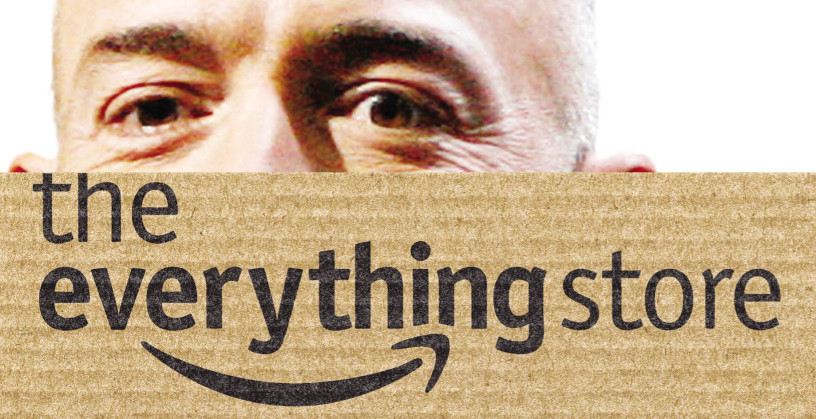

## <a name="intro">A fascinating ride</a>

Jeff Bezos is now one of the richest people on earth and world-famous for his fierce leadership and stunningly bold, yet accurate, visions about the future. It is inspiring to read about Amazon's journey, and how it was not always straight, rather quite rocky, and involved a lot of difficult and controversial decisions. Also, how the company almost collapsed several times but has managed to survive and thrive in new areas that were not even thought of back in 1994 - for example, that the e-book market would be huge and the fact that Amazon with Kindle would become a massive hardware company, or even more remarkable - that Amazon would be the leading provider of web services with AWS. It seems this ability to innovate has stayed with the company since the beginning and has been essential in the success of the company.

## <a name="relentless-drive">A relentless drive</a>

Jeff came from humble beginnings. I liked reading about how his father, whom he did not grow up with, traveled the country, performed with a unicycle team, and then went on to own a bike shop. I think this shows some of the nerdiness Jeff inherited, the ability to completely dedicate and immerse himself into a subject and stick with it. Also, Jeff had some great examples growing up in terms of morale and ambitions, with his hard-working step-father and mom who believed in him all the way - and even invested his first \$300K, even though he clearly warned them it was only a 30% chance of succeeding. It is also remarkable to leave your high-end lifestyle on Wall Street, to travel across the country, without even having a set address, starting in a garage and packing books all day long. That is a real entrepreneurship spirit, with huge opportunity costs. It shows the dedication, bravery, and relentless drive that goes on to change the world.

## <a name="customer-centric">Putting the customer first</a>

Amazon was run in a chaotic startup fashion long after it exceeded the starting up phase. Maybe this is one of its huge weaknesses, or maybe the greatest asset of all time. In the footsteps of Jeff's hard and determined leadership style, Amazon has been a ruthless actor, pushing margins and forcing out competitors. For example, Amazon leveraged their power on weak smaller publishers first, forcing them to comply with their demanding terms, before approaching the larger actors. In my opinion, this is not a very appealing way of conducting business at all times, but you got to admire the customer-centric approach that is present throughout the core of the company and affects all their decisions. Amazon worked with this culture, by establishing artifacts such as the iconic office desks made out of wooden doors and policy to never fly business, but more importantly, they took on huge initial losses to offer Amazon Prime, arranged extra-ordinarily cheap shipping, and always pushed margins, as an investment in expansion. This is probably the best possible aspect of embracing the startup culture at all stages of a venture - the fact that you never stop caring about your customers or get too far away to hear them. Maintaining this feedback loop is what builds great companies.

## <a name="swedish-tea-rating">Swedish Tea rating</a>

Swedish Tea Rating: ☕☕☕☕☕

Truly a great book. I enjoyed reading the mix of informative biography and fascinating stories from within a hyper-growth journey. The book kind of retains this mythical status of Bezos, and I am not sure what to think of that. But it is REALLY rewarding to understand the environment that produced Jeff Bezos, as well as the ups-and-downs of the company on its' way to the top.

Find the book on Amazon: https://amzn.to/2LKIT6L

Want find out more about my reading journey - see the post about <a href="/book-reading-goal/">my 2021 reading goal</a>.
