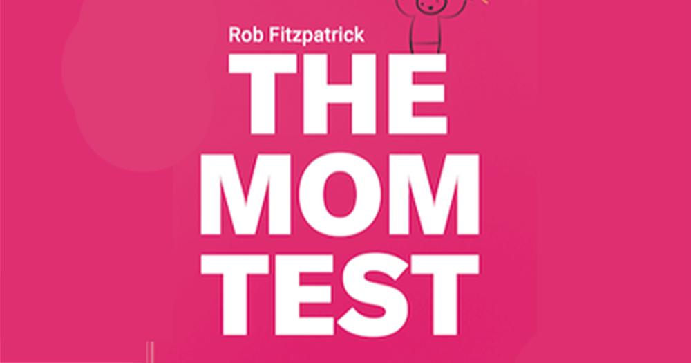

## <a name="intro">Turn hypotheticals into concrete actions</a>

The Mom Test is a method to extract the most valuable information from conversations and cut through all the fuzziness. The book is full of practical tips. I love the part about how to avoid biasing early customers by reducing the amount you talk about your idea, and instead really emphasize listening, avoiding pitch mode. View the goal of early-stage sales meetings as learning, with revenue being a side-effect.

> The more you’re talking, the worse you’re doing.

By waiting with the pitch, we avoid people having to protect our feelings by giving artificial compliments. We need to extract hard facts about their lives and perspective to learn how to make a great product.

## <a name="customer-centric">Some problems don't matter</a>

All problems are not big enough, urgent enough, profitable enough, or meaningful enough to solve. Make sure you are solving a problem in need of being solved. Know who has the problem and that they have the budget to solve the problem.

Also do not just stack up feature requests. Instead, ask questions to find the underlying reasons behind those requests. Do not just treat the symptoms by building what the customers THINK they want.

## <a name="efficient-meetings">Have efficient meetings</a>

Meetings have binary outcomes. A meeting either succeeds or fails. The book focuses on how to conduct successful meetings - not just asking the right questions, but starting at the preparations - why should we even take the meeting? What kind of meeting format makes sense - digital or physical? And what are our overall goals with the meeting?

> Casual chats are preferred over formal meetings.

Also constantly having three big questions for your startup to answer was an eye-opener for me, and I think this can be hugely helpful in creating the right circumstances for serendipity. Then you can align the meeting to extract information to answer all of these, or a subset of them, to move your overall business forward at all times. Also, by taking those additional minutes to prepare the meeting beforehand you exponentially increase the odds of having a valuable meeting. A successful meeting helps answer your big questions, it helps you understand your customers, and it pushes for the right next steps. The next steps involve customer commitment and advancement. Do not leave the success of the meeting up to chance - prepare before and review your learnings after.

## <a name="currencies-of-commitment">The currencies of commitment</a>

Making customers commit is part of the ultimate goal of any sales meeting, meaning you advance the customer through your sales funnel. Commitment takes form in some currency, and the major currencies are:

- time
- reputation risk
- cash

The process of getting that commitment is substantially easier with warm intros, or when customers come to you, not the other way around. Allow people to find you by organizing meetups, deploying content marketing, industry blogging, speaking, and teaching.

## <a name="customer-segmentation">Segmenting your customers</a>

When you have an unclear sense of who you are serving, you will end up talking to a diverse group of people, which will produce inconsistent signals and requests. Make sure you narrow down your customer segment further - deploy "customer slicing", by taking a customer segment and slice of better and better subsets of customers, until you have a clear sense of who to serve, and how to find them.

## <a name="swedish-tea-rating">Swedish Tea rating</a>

Swedish Tea Rating: ☕☕☕☕☕

The book is providing clear tips that can be easily implemented. I think it was highly relevant for me as a founder of a startup in the growth phase but would have been just as good for someone wanting to take their undefined idea into reality. I have already started implementing several of the tips into my daily meetings, and I feel an instant improvement. Small adjustments in what questions to ask, when to enter pitch mode, knowing how to deflect compliments, recognizing vagueness, and putting a bit more effort into preparations make a huge difference. Super practical and easy-to-implement, without being trivial.

Find the book on Amazon: https://amzn.to/2Y2uWnQ

Want find out more about my reading journey - see the post about <a href="/book-reading-goal/">my 2021 reading goal</a>.
