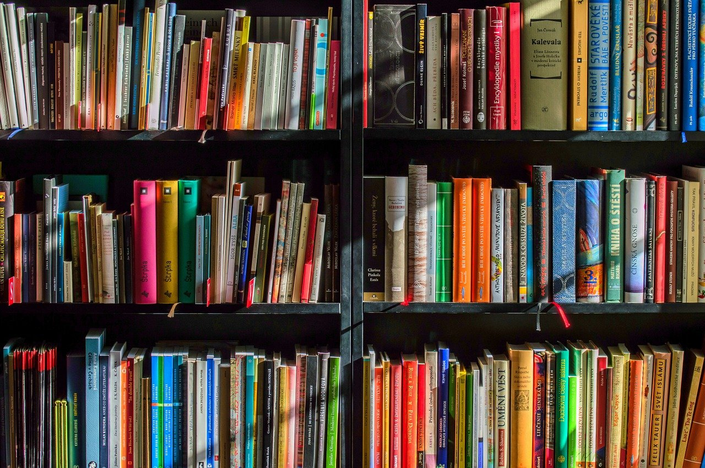

1. [The Power of Setting Goals](#intro)
2. [My 2021 Reading Goal](#reading-goal)

## <a name="intro"> 1. The Power of Setting Goals</a>

The process of setting goals is not just a nice-to-have in your toolbox, it's shown to be an extremely powerful common denominator amongst successful people. The goals you set should be SMART, in the sense that they are:

- Specific
- Measurable
- Attainable
- Realistic
- Time-bound

I experienced the power of setting goals - and maybe most importantly - writing my goals down, in high school for the first time. I started writing down small physical notes with clear goals I wanted to achieve for the next months or coming year. For example, early on I wrote down the fact that I wanted to go on an exchange semester to the U.S., I also stated I want to study at the top technical university in Sweden - the Royal Insitute of Technology KTH. These were clear goals, whose success or failure could easily be evaluated, due to their binary nature. As time went by, I broke these goals down into even more tangible tasks like the fact that I wanted a scholarship for my exchange semester and then specific subtasks - to find and apply for the available scholarships, etc. Well, you get the picture.

A few years later I found these notes and realized how many of these goals were fulfilled. To be honest, I was quite shocked to realize how many of these seemingly random success stories I had during the past years, actually were clearly defined goals, broken down into clear tasks and subtasks. I got a full-bright scholarship for my exchange semester to the U.S. and have now graduated with an M.Sc. in Computer Science from the Royal Institute of Technology KTH. It was a true rush, in first-hand realizing the power of setting and formulating goals. It felt like I could predict the future. I discovered one of the most important steps of creating serendipity, an essential tool used by the world's most successful people.

From that day, each New Year I write a list of goals for the coming year, now digitally in my iPhone. These are both professional and personal development goals. It has been a secret great tool of mine that helps me focus throughout the year. But also, most importantly celebrate the successes (and reflect on the failures) in post. It is like writing those letters to your future self in middle school, but you have the chance to follow-up on these goals continuously and evolve.

## <a name="reading-goal"> 2. My 2021 Reading Goal</a>

This year involved one major goal for my personal development - dedicating proper time for reading. More specifically, reading 52 books - one per week.

I used to read a lot as a child; I read fast and I read anything my mom would bring me from the library. She used to ride her bicycle home from work with heavy bags with books, one on each handlebar, for me and my brother. The Famous Five by Enid Blyton and Narnia were some major favorites that I re-read probably a million times. As I grew older I mostly focused on course literature, articles online, and never really dedicated proper time for reading. I bought a Kindle on my exchange a year ago to Singapore, but mostly read business cases from Harvard Business Review.

I have now graduated and will re-ignite the habit of reading in my free time. Best of all - I am planning to post all of the summaries, reviews, and interesting notes from my reading adventure ahead, on this very blog. I am excited and hope you can be inspired by this post on the power of setting goals. Go out and set some goals of your own for 2021, you will be amazed when you look back at that list at the end of the year!
