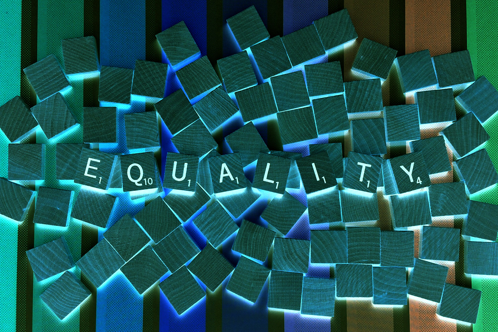

1. [Intro](#intro)
2. [Loose Equality](#loose-equality)
3. [Strict Equality](#strict-equality)
4. [Assigning inside if](#assigning-inside-if)

## <a name="intro"> 1. Intro</a>

Having an understanding of how to test for equality in JS is a fundamental in your JavaScript tool bag, and if done wrong, could cause a lot of confusion and unclarity. To follow along, I would recommend to go to your browser, navigate to the Inspector and open up the Console tab. This Console is a
<a href="https://en.wikipedia.org/wiki/Read%E2%80%93eval%E2%80%93print_loop" target="_blank">REPL (Read Evaluate Print Loop)</a> where you can input JavaScript that will be evaluated and printed directly; perfect for sketching out some minor ideas, playing around with new features and getting comfortable with the JavaScript language.

There are two major ways to check if two things are equal to each other in JS. Either you could use loose equality, defined by the double equals sign '==', or strict equality, defined by triple equals sign '==='.

## <a name="loose-equality"> 2. Loose Equality</a>

_Loose equality_ (==), also called abstract equality, means a type conversion will be performed BEFORE comparing the two objects; meaning the following expression is true:

```
console.log(1337=="1337")
// logs 'true'
```

## <a name="strict-equality"> 3. Strict Equality</a>

_Strict equality_ (===), will do the same comparison, but WITHOUT the initial type conversion. This means the values will be compared directly, and if their type differs, the expression will be evaluated as false. Thus, the following expression is now evaluated as false:

```
console.log(1337==="1337")
// logs 'false'
```

Try it yourself in your browser's REPL!

## <a name="assigning-inside-if"> 4. Assigning inside if</a>

_Assigning inside the if statement_ (=), will always return true, eventhough it's not a comparison. The value will also be assigned to the variable:

```
if(numberOfCups = 1337){
    console.log("I want this many cups of tea:", numberOfCups)
}

// logs 'I want this many cups of tea: 1337'
```

If you would like another review or prefer your tea in a more interactive format, check out my Youtube video on this topic below:

<iframe width="560" height="315" src="https://www.youtube.com/embed/ck2PN0JvjnQ" frameborder="0" allow="accelerometer; autoplay; encrypted-media; gyroscope; picture-in-picture" allowfullscreen></iframe>
<br/>
Until next time, stay programming and see you soon!
