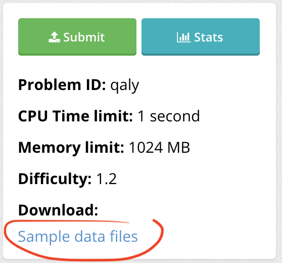
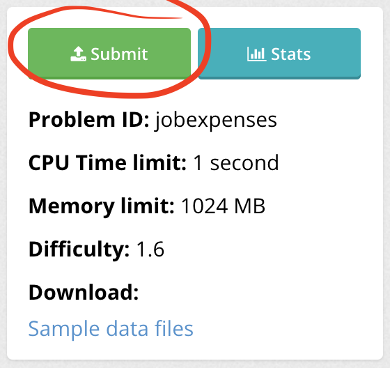
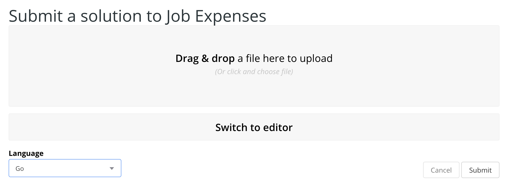

If you need a brief introduction to Kattis, i.e. part 1, please refer to <a href="/kattis-intro-1">the article</a> I wrote on this topic a couple of weeks ago or the <a href="https://youtu.be/V0PUy29vFd8">Youtube video</a> if you prefer your Swedish Tea in a more interactive format. Today, in part 2, we will go through how to handle input and output in Kattis using Go. However, the concepts apply to any programming language, [this guide](https://open.kattis.com/help) could be helpful if your working in another language and want the exact syntaxes for working with stdin/stdout.

1. [Kattis problem structure](#problem-structure)
2. [Input in Kattis](#input)
3. [Output in Kattis](#output)
4. [Submit your solution](#submit)
5. [Final words, full code and videos](#final-words)

## <a name="problem-structure"> 1. Kattis problem structure</a>

Solving a problem on [Kattis](https://open.kattis.com) requires understanding the problem structure. Lucky for us, it's simple. We have an input and need to produce an expected output. Our task is to use this data and write a script that transforms the input to match the output. The data, i.e. input and output consist of sample files that we download and unzip from the Kattis problem page.



_Sample data files to download on the Kattis problem page_.


## <a name="input">2. Input in Kattis</a>

So we have downloaded our sample files to our local workspace folder. Let's look at the `.in` input files and how we can read these via standard input into our script. In order for Kattis to be able to test our solution we need to read the input from `stdin`, so we might as well get into the habit of implementing this in all of our Kattis programs. It is also convenient reading from `stdin` during dev, since we can easily pass in custom input of our choice and thus test our program. Using the terminal and passing an input file to a Go script via stdin will look like:

```shell
go run kattis-script.go < input-file.in
```

We then need to treat the input file correctly in our `kattis-script.go`. The exact implementation will of course depend on the content of the input file. Let's look at the first sample input of the [Job Expenses problem](https://open.kattis.com/problems/jobexpenses/statistics) on Kattis:

```in
3
1 -2 3
```

*01.in*

The number in the first row is stating how many entries are present in the second row. Go provides the [fmt package](https://golang.org/pkg/fmt/) for handling I/O, so let's import fmt and use the Scanf() method that comes with fmt to read the first row from stdin:

```go
package main

import (
	"fmt"
)

func main() {
	var numberOfEntries int
	fmt.Scanf("%d", &numberOfEntries)
}
```

We declare the numberOfEntries variable as an integer, since for this problem, we know the first row will always contain the number of entries as an integer. Scanf will parse the arguments according to a format string, i.e. the first parameter we provide to Scanf. The format string in this case is `"%d"`, where we specify we are looking for an integer of base 10. The second parameter is a pointer to the variable where the matching value from stdin will be stored, in this case we point to the variable `numberOfEntries` via the pointer `&numberOfEntries`.

For the second row of the output I declare a function `readEntries(n int)`, that will take an arbitrary number `n` and read that many entries into a slice:

```go
func readEntries(n int) ([]int, error) {
	in := make([]int, n)
	for i := range in {
		_, err := fmt.Scanf("%d", &in[i])
		if err != nil {
			return in[:i], err
		}
	}
	return in, nil
}
```

We use the same method Scanf() and store the value into the slice `in` by referencing it via pointers, in the same manner as we did previously. Now we have the input stored in suitable data structures, and we can proceed solving the actual problem as well as return the output for Kattis.

## <a name="output">3. Output in Kattis</a>

For returning to Kattis we can use the `Println()` or `Printf()` method that comes with `fmt`. This will neatly print out our resulting output. Println adds a newline after each call, which could be convenient in some cases. Let's say we have a `calculateExpenses(entries []int)` function that takes the slice we created in the previous step and simply returns an integer with the sumed up expenses we are looking for. Then we could write our output to Kattis like this:

```go
totExpenses := calculateExpenses(entries)
fmt.Println(totExpenses)
```

## <a name="submit-to-judge">4. Submit your solution</a>

Now make sure to clean your code up and remove any unnecessary outputs that you might have from dev. Any deviations or extra content on stdout will cause Kattis to reject your solution, so double-check this by running your code in the terminal before submitting:

```go
go run job-expenses.go < samples/01.in
2
```

The output looks clean and tidy, so let's proceed by submitting to Kattis.



*Submitting your solution via the Kattis problem page*.


We drag and drop our code over to the designated area, double check that the language is correctly identified as Go, and press submit.

Hopefully your solution passes all the Kattis tests and you can achieve your points and proceed to the next one. Great job! If your solution fails some test, go back to the drawing board, think about edge cases and try to write some own tests and see how your code behaves. Also going through each function and line of code, thinking about it's purpose and behaviour can help in the debugging process.


## <a name="final-words">5. Final words, full code and videos</a>

I hope this was a useful tutorial on the basics of Kattis I/O and how you go about submitting a solution to Kattis in Go. If you prefer a video format walkthrough, I have prepared a working example of solving the Job expenses problem on Kattis. Definitely go check the videos out below. Also resort to [my Github for the full code](https://github.com/rintala/kattis-solutions/tree/master/job-expenses) of this problem, and stay tuned for more Swedish Tea coming soon!

<iframe width="560" height="315" src="https://www.youtube.com/embed/V0PUy29vFd8" frameborder="0" allow="accelerometer; autoplay; encrypted-media; gyroscope; picture-in-picture" allowfullscreen></iframe>

<iframe width="560" height="315" src="https://www.youtube.com/embed/67qMDDvhNz0" frameborder="0" allow="accelerometer; autoplay; encrypted-media; gyroscope; picture-in-picture" allowfullscreen></iframe>