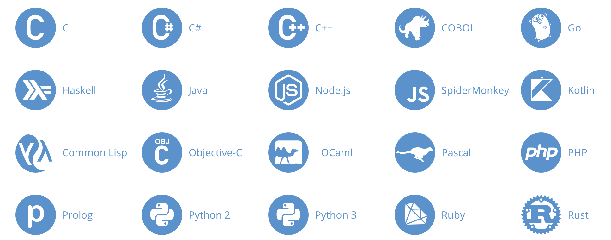
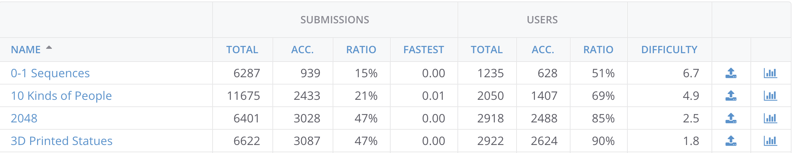

Kattis is a great online tool for automatically checking solutions to programming tasks; it has been a helpful addition to my programming journey and therefore I would like to share it with you. I started using it as part of my courses at KTH and have continued solving some Kattis problems on my spare time, improving my programming skills in Java, Python and C++.

1. [Intro](#intro)
2. [Why use Kattis?](#why-use-kattis)

3. [Final words and next part](#final-words)

## <a name="intro"> 1. Intro</a>

[Kattis](https://open.kattis.com) is a free tool developed by the competive programming department @ [KTH Royal Institute of Technology](https://www.kth.se/) in Sweden. Kattis consists of a platform offering hundreds of programming problems for you to solve and automatically checks them for you. The platform also has a ranking list for each problem based on time complexity and accepts solutions in about 20 languages!

*Solutions for these languages are currently accepted*

Kattis also indicates a level of difficulty on each problem, so you can start with the easy ones and work your way up, or in whatever order suits you. In addition to the difficulty level you can view other users' performance on each task, and in that way get a sense for how many attempted the problem vs. how many actually solved it, etc.

​		

*A sample of the problem list in Kattis*

## <a name="why-use-kattis">2. Why use Kattis?</a>

I love learning about programming techniques by reading articles and books, but for me *implementation is everything*. It is first once you have implemented the concepts and patterns in real code you truly start understanding them and begin to grasp the WHY behind using them. So whether you learn programming in a traditional setting through a university or on your own, the skills of understanding the WHY is fundamental and can be improved through use of Kattis. In addition, I have experienced the following upsides with using Kattis:

- Building practical experience.

- Learning and understanding time complexity.
- Diving into a new language.
- Driving you to code, while doing it fast and accurately.
- Developing a portfolio.

**Practical experience**

Just like any other programming task or project, Kattis helps you gain valuable practical experience in programming. You get familiar with how to structure your code, how to find bugs, where bugs usually appear, as well as everything else related to actually producing well written code. 

**Understanding time complexity**

You also start to gain a more proper understanding for time complexity, and it also becomes more interesting as you have true incentives to build fast code, as you will want to achieve a spot on the ranking list! Suddenly it becomes essential to think about things like using fast I/O, storing data in hashmaps and eliminating unnecessary loops. For me Kattis has also served a purpose as a way to gain some practical knowledge in a particular new language. I wanted to get some experience in C++ and therefore decided to complement my tutorials and books with some tasks on Kattis, which definitely improved my understanding of the language and made me more comfortable using it. 

**Writing generic code**

Furthermore, Kattis drives you to produce code as you solve fun tasks and will check that you actually write well functioning code that produces the correct output; thus, not just fulfilling the single test case you had thought of yourself. This also improves the valuable skills of understanding how to write generic code; i.e. code that does not just work in one specific case, but can be applied to a number of sitations and scenarios. Such a skill is a truly valuable asset in any project. Let's say you get your first job as a Junior Developer in a larger scale project and write a util function to assist with sorting a list in your component. However, you have to get it to work ASAP and don't consider making it truly generic, thinking about different implementations and use cases. You implement it in your component, and it appears to be working - sweet! A few weeks later another team member has a similar problem of sorting lists, he scrolls through the utils functions and discovers the function you have written. He then proceeds to implement it in his component without looking too much at it. After a while bugs related to sorting start to appear in his component and he spends lots of time trying to find the source, until he finally discovers the utils function and the fact that it was not generic. A lot of time could go to waste on such a situation and therefore an important skill is to be able to think generic. Kattis forces you to do this, with a system of several unknown test cases your solution has to pass. It is often times very tideous and bothersome trying to get the solution accepted, if you have a minor bug or deviation, but in the end it makes you a better programmer. 

**Developing a portfolio**

Finally, by being able to show a track record of well executed and correct tasks on Kattis, you can show potential firm that you have actual competence in a language and can produce useful code. Of course this can be done in a lot of other ways - by working in open-source projects, maintaining a clean Git portfolio, etc. But Kattis is a nice way to solve smaller tasks, one by one, and for yourself see your progression as you become a more comfortable, competent and productive programmer.

## <a name="final-words">3. Final words and next part</a>

I hope you enjoyed this brief description of what Kattis is and why you should use it. I have thoroughly enjoyed using the platform and I hope you will too. In the next part I will go through an example of what solving a Kattis problem could look like; explaining in code how to handle I/O, etc. Stay tuned!