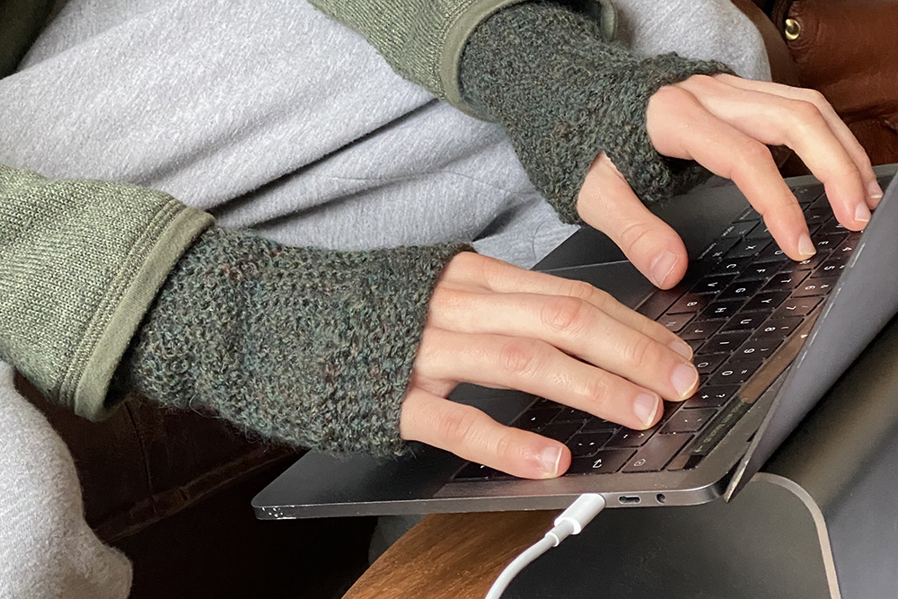

 \* _Don't mind the
👖, they are part of the home office attire for the weekends_

## <a name="intro">Keep Hands Warm, Type Fast, and Stay Stylish</a>

So, at the moment our startup has office space at an incubator in Stockholm. The building is a so-called 'smart-house' which means the heating is dynamically adjusted and takes into account that people will generate heat. However, the problem with COVID - the offices are literally empty, which results in freezing temperatures and numbing cold fingers for us that live on walking-distance to the offices. The CTO of our neighboring team wears a coat, hat, and scarf, while programming. For myself, the Patagonia sweater is absolute heaven and keeps the body warm, but my fingers and hands are suffering. I have been looking out for solutions to this problem, but there are no real good gloves for programming, either they are too thick in the finger material to type, or they are not really adding any isolation. This Christmas I received one of the best gifts ever - my girlfriend's mom had heard the rumor that I was looking for gloves, and hand-knitted these awesome custom-made gloves that are both warm, comfortable, and fit my favorite Patagonia sweater in color! Couldn't be happier - no more freezing hands in the raging Swedish winters! And the fingers are free to move over the keyboard at ultra-speed.

Thought I would share this, maybe someone is looking to solve this very same problem of cold hands when programming. Make sure you get your exercise and circulation flowing, but also maybe ask a grandma, mom, or relative to knit you a custom pair of super gloves. Or even look up a tutorial and make your own!

Stay coding!
